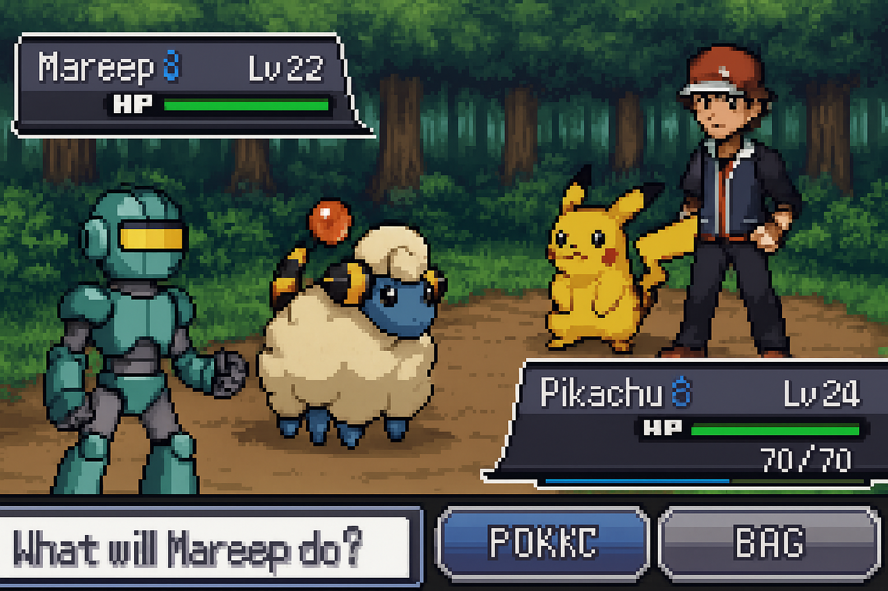
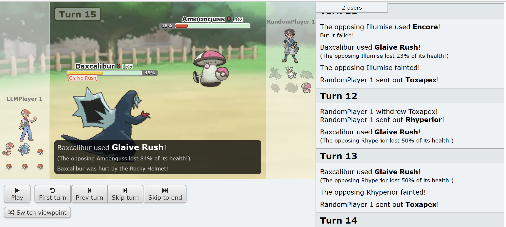

# 🕹️ Poke-LLM (LLM-powered Pokémon Battle Agent)

[한국어 버전](README.md)



> Do LLMs dream of Mareep?

This is an experimental project that applies **LLMs** and **RAG** to Pokémon battles.  
Built on [poke-env](https://poke-env.readthedocs.io/en/stable/), it features battles between `LLMPlayer` and `RandomPlayer`.  
The ultimate goal is to expand towards **local inference** and **reinforcement learning (RL)**.

---

## Features
- **poke-env Simulation**  
  [poke-env](https://poke-env.readthedocs.io/en/stable/) is a Python library that integrates with Pokémon Showdown.  
  It is widely used in reinforcement learning research and agent experiments.  
  Since it provides a Gym-like API, it can be treated as an RL environment, and custom agents can be created and pitted against each other.

- **LLMPlayer Implementation**  
  A custom agent that inherits from poke-env's `Player` class, allowing an LLM to decide whether to `move` or `switch`.  
  Currently tested with the OpenAI API, with plans to expand to local inference.

- **RandomPlayer vs LLMPlayer**  
  Run battles between the default `RandomPlayer` and the LLM-driven player for testing.

- **Fallback Strategy**  
  If the LLM output fails or cannot be parsed, a safe fallback is used (choosing the move with the highest expected damage).

- **Logging**  
  Every LLM decision is logged in `llm_traces.jsonl`, allowing turn-by-turn analysis of actions and reasoning.

---

## Installation

```bash
# clone repo
git clone https://github.com/Jaeuk-Han/poke-llm.git
cd poke-llm

# install with poetry
poetry install
```

---

## How to Run

### 1. Run LLM vs RandomPlayer
```bash
poetry run python src/agent/test_llm_vs_random.py --battles 3 --format gen9randombattle
```

Options:
- `--battles`: number of battles to run (default=1)
- `--format`: battle format (e.g., `gen9randombattle`)
- `--debug-llm`: show detailed LLM prompts and responses
- `--open`: automatically open spectator URL in browser

### 2. Example Output
```
--- TURN 1 ---
My: {...} Opp: {...}
[DECIDE] MOVE idx=0 (earthquake) | reason=highest damage with STAB

Done. LLM won 2 / lost 1
```

---

## Sample Trace Log

The LLM decision process is logged in JSONL format.  
Here is a simple example showing what action the LLM instructed Baxcalibur to take on **turn 15**:

```json
{
  "event": "llm_ok",
  "turn": 15,
  "parsed": {
    "action": "move",
    "index": 0,
    "reason": "highest damage with STAB"
  },
  "state": {
    "my_active": {"species": "Baxcalibur", "hp_pct": 48},
    "opp_active": {"species": "Amoonguss", "hp_pct": 100}
  }
}
```

- `"event": "llm_ok"` → LLM response parsed successfully  
- `"turn": 15"` → Current turn number  
- `"action": "move"` → Decided to use a move instead of switching  
- `"index": 0"` → Chose the first available move (e.g., Glaive Rush)  
- `"reason": "highest damage with STAB"` → Chosen because it deals the most damage with Same-Type Attack Bonus (STAB)  
- `"my_active" / "opp_active"` → Current Pokémon on the field and their HP status  

For the full logs, see [sample_trace.json](assets/docs/sample_trace.json).

---

## 📂 Project Structure

```bash
poke-llm/
├── src/
│   └── agent/
│       ├── llm_player.py        # LLM-based agent (inherits poke-env Player)
│       └── test_llm_vs_random.py# Run LLM vs RandomPlayer
├── logs/
│   └── llm_traces.jsonl         # LLM decision logs
├── pyproject.toml               # Poetry configuration
├── README.md                    # Korean README
├── README.en.md                 # English README
└── .gitignore
```

---

## 📸 Screenshots

### 1. Example Run (LLM vs Random)


---

## Roadmap
- [x] Integrate poke-env environment
- [x] Implement LLM-based decision-making (API)
- [ ] Add local inference (in progress)
- [ ] Apply reinforcement learning (RL)
- [ ] Visualize and analyze battle logs

---

## 📜 License
MIT License
