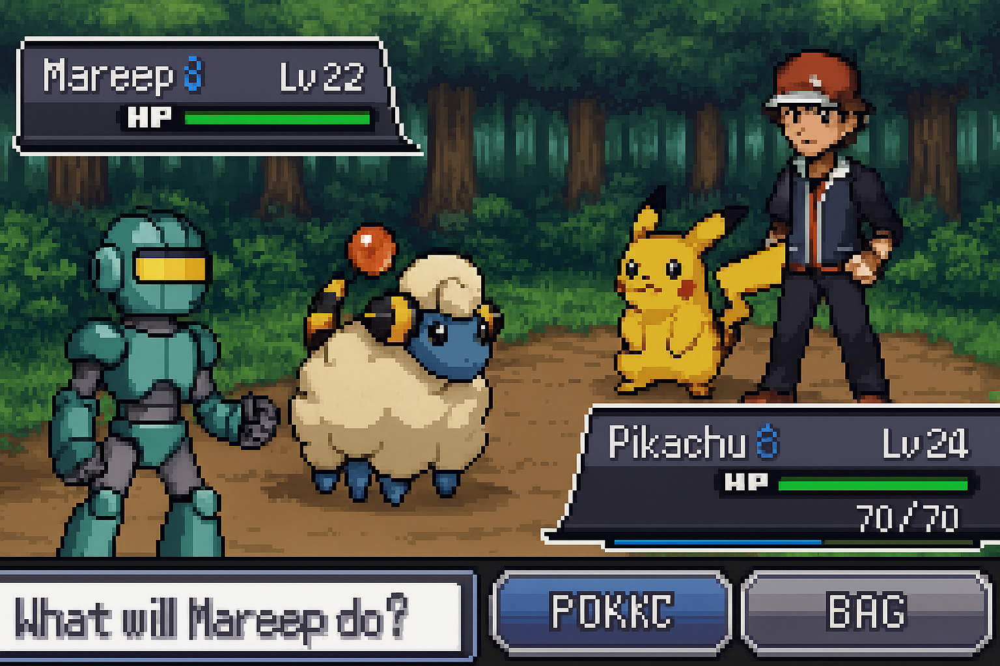
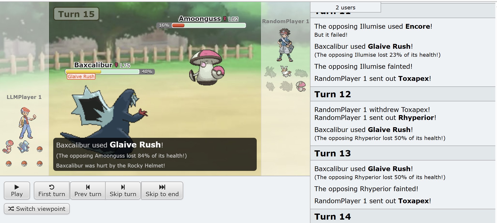

# 🕹️ Poke-LLM (LLM-powered Pokémon Battle Agent)

[English Version](README.en.md)



> LLM은 메리프의 꿈을 꾸는가?

LLM과 RAG를 이용해 포켓몬 배틀을 해보는 실험 프로젝트입니다.  
[poke-env](https://poke-env.readthedocs.io/en/stable/) 환경 위에서 `LLMPlayer`와 `RandomPlayer`를 대결시키고,  
이후에는 **로컬 추론 모델**과 **강화학습(RL)**으로 확장할 계획입니다.

---

## Features
- **poke-env 기반 시뮬레이션**  
  [poke-env](https://poke-env.readthedocs.io/en/stable/)은 Pokémon Showdown과 연동되는 Python 라이브러리로,  
  강화학습 연구 및 에이전트 실험에 자주 사용됩니다.  
  Gym 스타일 API를 제공하기 때문에 강화학습 환경처럼 다룰 수 있고,  
  에이전트를 직접 구현해서 서로 붙이는 것도 가능합니다.

- **LLMPlayer 구현**  
  poke-env의 `Player` 클래스를 상속해 LLM이 `move`/`switch`를 선택하도록 만든 커스텀 에이전트.  
  현재는 OpenAI API 기반으로 테스트 중이며, 차후 로컬 추론 모델로 확장 예정입니다.

- **RandomPlayer vs LLMPlayer 테스트**  
  poke-env에서 기본 제공하는 `RandomPlayer`와 LLM 기반 플레이어를 직접 붙여 테스트.  

- **Fallback 전략**  
  LLM 출력이 잘못되거나 파싱에 실패했을 때, 기대 대미지 기반 안전한 선택을 수행.  

- **로그 기록**  
  `llm_traces.jsonl`에 LLM 추론 과정을 기록해, 매 턴 어떤 선택을 왜 했는지 추적 가능.

---

## Installation

```bash
# clone repo
git clone https://github.com/Jaeuk-Han/poke-llm.git
cd poke-llm

# install with poetry
poetry install
```

---

## How to Run

### 1. LLM vs RandomPlayer 실행
```bash
poetry run python src/agent/test_llm_vs_random.py --battles 3 --format gen9randombattle
```

옵션:
- `--battles`: 실행할 판 수 (default=1)
- `--format`: 배틀 포맷 (예: `gen9randombattle`)
- `--debug-llm`: 프롬프트/응답 로그 자세히 출력
- `--open`: 관전 URL 자동으로 브라우저 열기

### 2. 실행 예시
```
--- TURN 1 ---
My: {...} Opp: {...}
[DECIDE] MOVE idx=0 (earthquake) | reason=highest damage with STAB

Done. LLM won 2 / lost 1
```

---

## Sample Trace Log

LLM 추론 과정은 JSONL 형태로 저장됩니다.

추론 결과 확인을 통해 LLM이 어떤 기술을 골랐는지 그리고 이유는 무엇인지 확인 가능합니다.

```json
{"event": "llm_ok", "turn": 1,
 "parsed": {"action": "move", "index": 0, "reason": "highest damage with STAB"},
 "state": {"my_active": {"species": "sandslash"}, "opp_active": {"species": "volcanion"}}}
```

---

## 📂 Project Structure

```bash
poke-llm/
├── src/
│   └── agent/
│       ├── llm_player.py        # LLM 기반 에이전트 (poke-env Player 상속)
│       └── test_llm_vs_random.py# LLM vs RandomPlayer 실행 스크립트
├── logs/
│   └── llm_traces.jsonl         # LLM 추론 로그 저장
├── pyproject.toml               # Poetry 설정 파일
├── README.md                    # 프로젝트 소개
└── .gitignore
```

---

## 📸 Screenshots

### 1. 실행 예시 (LLM vs Random)


LLM 추론 과정은 JSONL 형태로 저장됩니다.  
아래는 간단한 예시로, **턴 1에서 LLM이 드닐레이브(Baxcalibur)에게 어떤 행동을 명령했는지**를 보여줍니다.

```json
{
  "event": "llm_ok",
  "turn": 15,
  "parsed": {
    "action": "move",
    "index": 0,
    "reason": "highest damage with STAB"
  },
  "state": {
    "my_active": {"species": "Baxcalibur", "hp_pct": 48},
    "opp_active": {"species": "Amoonguss", "hp_pct": 100}
  }
}
```

- `"event": "llm_ok"` → LLM 응답이 정상적으로 파싱됨

- `"turn": 15` → 15턴째 상황

- `"action": "move"` → 교체가 아니라 기술 사용을 선택

- `"index": 0` → 가능한 기술 중 첫 번째 기술을 선택 (예: Glaive Rush)

- `"reason": "highest damage with STAB"` → 같은 타입 보너스(STAB, Same-Type Attack Bonus) 덕분에 가장 큰 대미지를 줄 수 있다고 판단 (자속기)

- `"my_active" / "opp_active"` → 현재 필드에 있는 포켓몬과 HP 상태 요약

자세한 로그 예시는 [sample_trace.json](assets/docs/sample_trace.json) 참고

---

## Roadmap
- [x] poke-env 환경 연동
- [x] LLM 기반 의사결정 (API)
- [ ] 로컬 추론 모델 연결 (진행중)
- [ ] 강화학습(RL) 접목
- [ ] 배틀 로그 시각화 및 분석

---

## 📜 License
MIT License